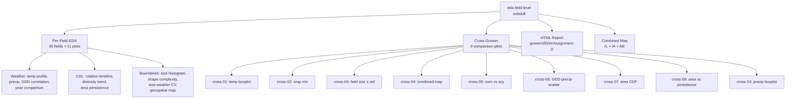
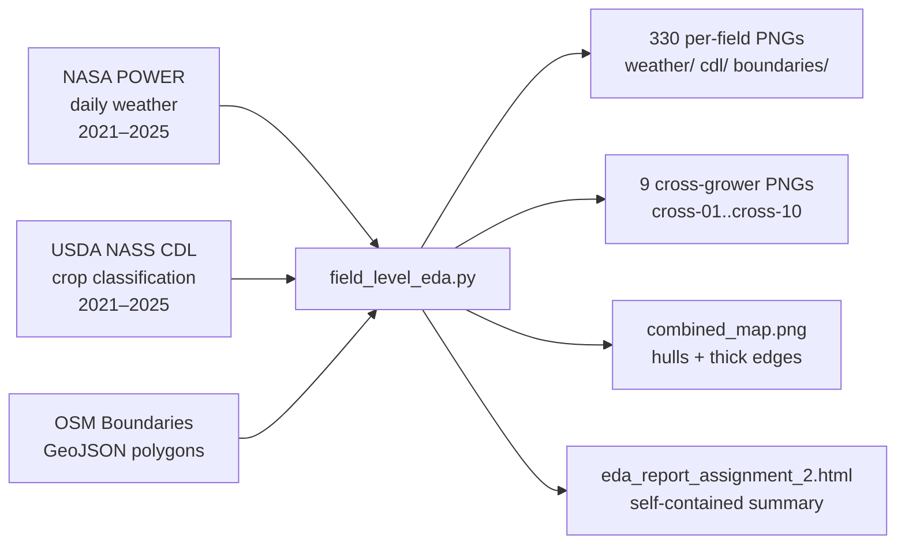
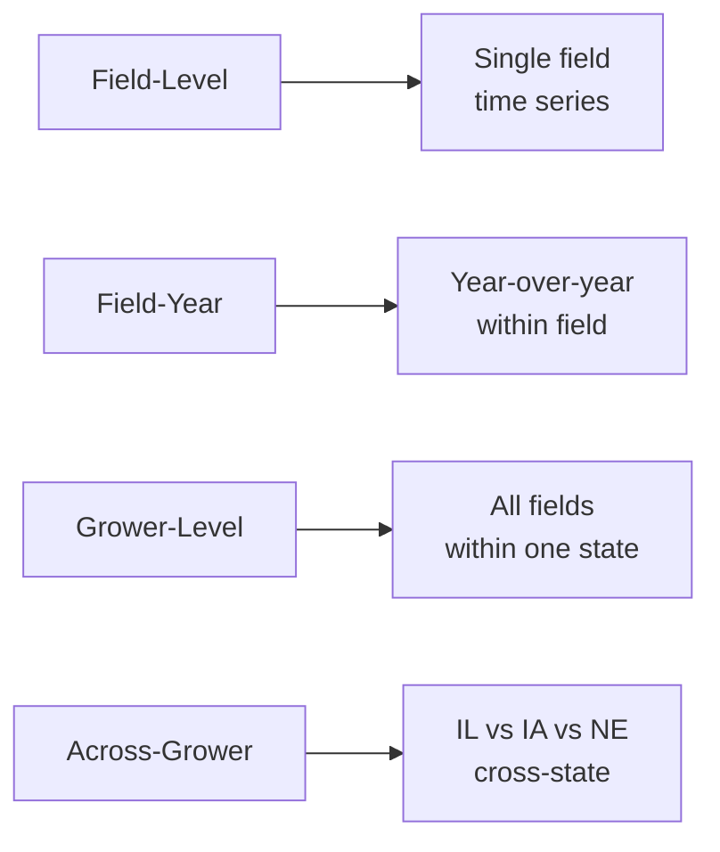

## Summary
This PR introduces the `eda-field-level` subskill for **Assignment 2**, delivering
a comprehensive exploratory data analysis (EDA) pipeline across **30 agricultural
fields** in **3 U.S. Corn Belt states** (Illinois, Iowa, Nebraska).

## What Was Built

### Architecture


### Data Flow


### Comparison Levels


### Output Structure
```
growers/EDA/Assignment-2/plots/
├── boundaries/          ← 120 boundary PNGs
├── cdl/                ← 91 CDL PNGs
├── weather/            ← 120 weather PNGs
├── combined_map.png    ← Enhanced IL+IA+NE map
└── cross-grower/
    ├── cross-01_grower_temp_boxplot.png
    ├── cross-02_grower_crop_mix.png
    ├── cross-03_grower_field_size_std.png
    ├── cross-04_combined_grower_map.png
    ├── cross-05_grower_corn_soy_share.png
    ├── cross-06_gdd_precip_correlation_by_state.png
    ├── cross-07_field_area_cdf.png
    ├── cross-08_field_area_persistence.png
    └── cross-10_precip_boxplot.png
```

## Files Changed
| File | Change |
|------|--------|
| `my-farm-advisor/eda/eda-field-level/` | **New subskill** — AGENTS.md, GUIDE.md, src/field_level_eda.py, src/generate_enhanced_map.py |
| `my-farm-advisor/eda/INDEX.md` | Updated to reference new subskill |
| `my-farm-advisor/data-pipeline/src/scripts/ingest/bootstrap_farm_from_county.py` | Fixed Overpass API User-Agent |

## Key Features
- **4 comparison levels**: field, field-year, grower, across-grower
- **2 statistical + 1 correlation per category**: weather, CDL, boundaries
- **No soil analysis**: explicitly excluded per assignment requirements
- **Self-contained report**: HTML with embedded CSS, relative image paths
- **Clean data organization**: all outputs under unified `EDA/Assignment-2/` folder

## Testing
- Full batch executed: 30 fields × 11 plots = 330 per-field outputs
- Cross-grower suite: 9 comparison plots verified
- Report validated: all image paths resolved, HTML well-formed
