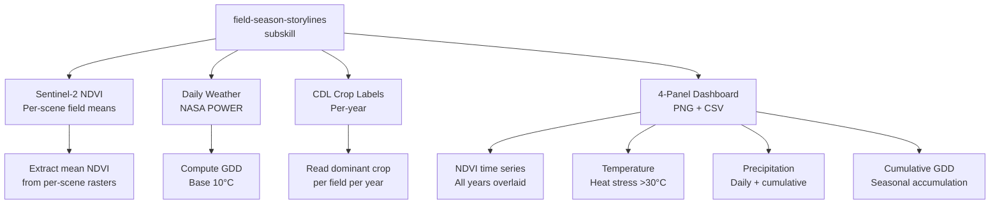
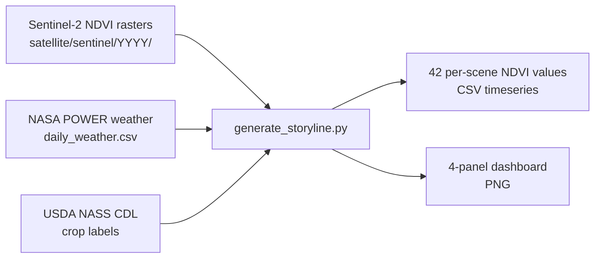

## Summary
This PR introduces the `field-season-storylines` subskill for **Assignment 3**,
generating multi-panel dashboards that combine Sentinel-2 NDVI, daily weather,
cumulative GDD, and CDL crop labels to tell the story of how weather drove crop
growth across the season.

## What Was Built

### Architecture


### Data Flow


### Prototype Selection

| Attribute | Value |
|-----------|-------|
| **Field ID** | `osm-1360316064` |
| **Grower** | `ia-grower` (Iowa) |
| **Prototype Year** | **2022** |
| **CDL Crop** | **Corn** (100.0% purity) |
| **NDVI Scenes** | 42 total (8-9 per year) |
| **Weather** | 1,826 daily rows, **0 gaps** |

### Output Structure
```
growers/ia-grower/farms/ia-grower-iowa/fields/osm-1360316064/derived/reports/storylines/
├── osm-1360316064_storyline.png          ← 4-panel dashboard
└── osm-1360316064_ndvi_timeseries.csv    ← Per-scene NDVI values
```

## Files Changed
| File | Change |
|------|--------|
| `my-farm-advisor/strategy/field-season-storylines/` | **New subskill** — AGENTS.md, GUIDE.md, SKILL.md, src/generate_storyline.py |
| `my-farm-advisor/strategy/INDEX.md` | Updated to reference new subskill |

## Key Features
- **NDVI extraction from rasters**: field-mean zonal statistics from Sentinel-2 per-scene NDVI rasters
- **5-year overlay**: all years (2021-2025) on one dashboard with year-specific colors
- **Crop labels from CDL**: per-year dominant crop annotated on each panel
- **Weather integration**: temperature, precipitation, GDD computed from daily weather
- **Clean prototype**: selected field with 100% CDL purity, complete weather, and dense NDVI coverage

## Testing
- Full pipeline executed for prototype field `osm-1360316064`
- 42 Sentinel-2 scenes extracted across 5 years
- Dashboard generated successfully (798 KB PNG)
- CSV validated: per-scene mean NDVI, min, max, std, pixel count
